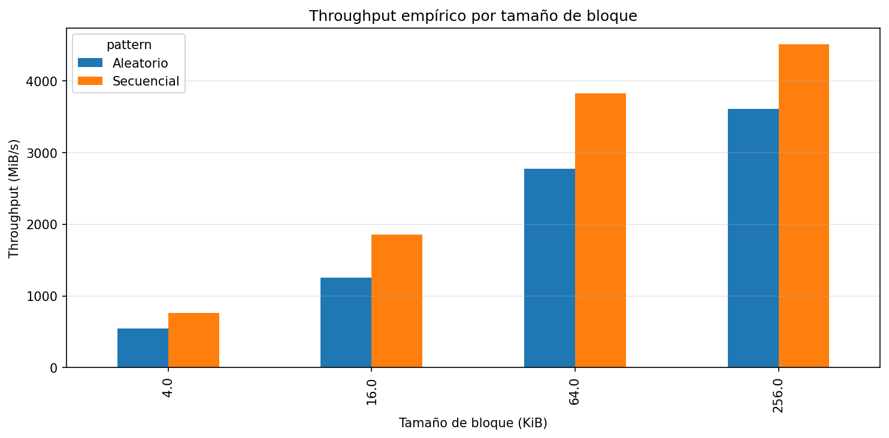
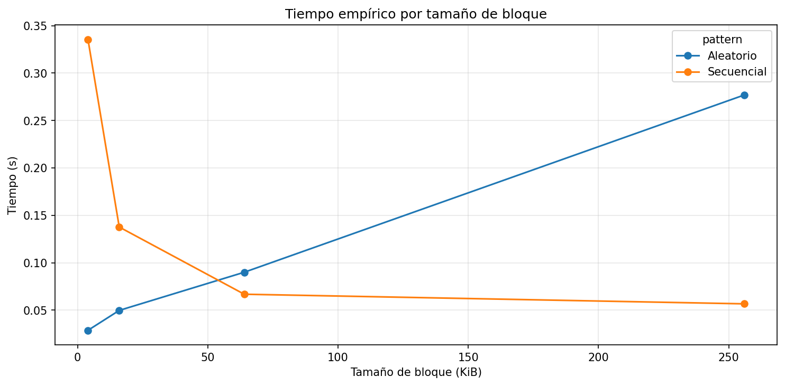
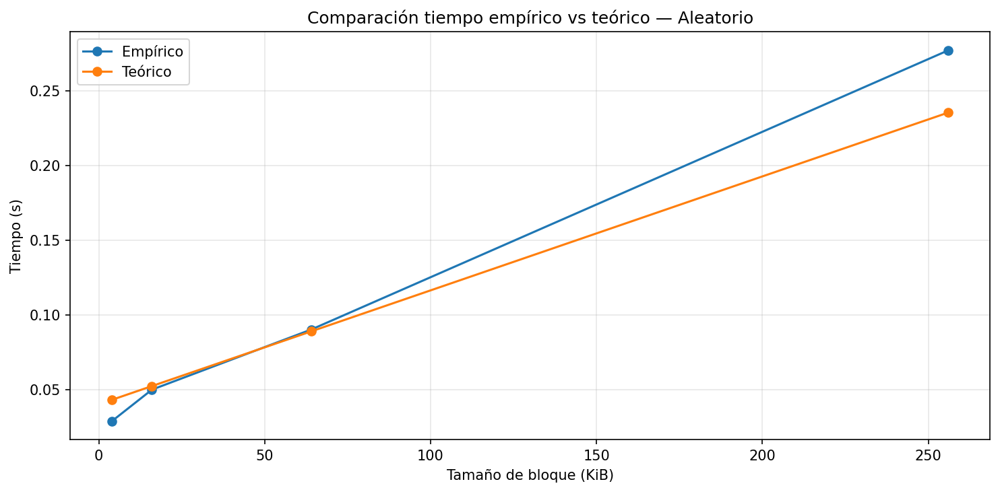
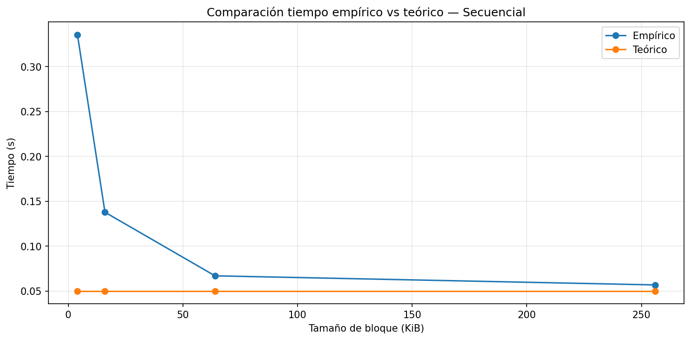
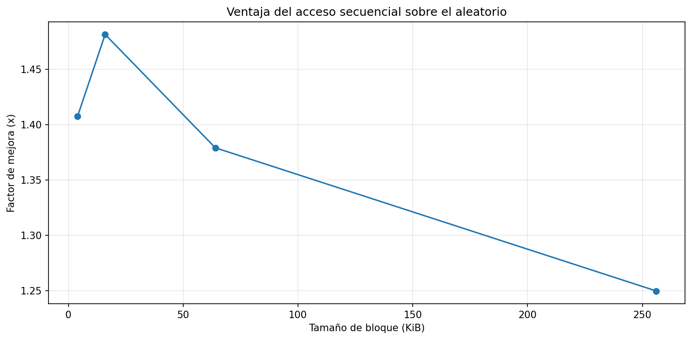

## 1. Tabla de caracterización 
| Parámetro | Valor Observado |
|----------|----------|
| Sistema Operativo   | Windows 11 Home 25H2    |
|CPU (Modelo y Frecuencia)  |   Inter Core Ultra 5 125H   |
| Arquitectura y Núcleos  | x64 / 14 nucleos  |
| Memoria RAM Total   |16 GB    |
|Tecnología de Almacenamiento  | SSD (NVMe)    |
| Carga de CPU en Reposo (%)  | 2% - 3%    |

## 2. Resultados del experimento 

## 3. Análisis y conclusiones
1. Comparación de patrones:

Con base en las mediciones, el acceso secuencial fue aproximadamente entre 1.25× y 1.48× más rápido que el acceso aleatorio, dependiendo del tamaño de bloque. El mayor valor fue de 1.48× en 16 KiB. Este resultado sí era esperado según la teoría, ya que el acceso secuencial evita saltos en el almacenamiento y reduce la latencia.

2. Efecto del tamaño de bloque:

El throughput del acceso aleatorio aumentó a medida que creció el tamaño de bloque, pasando de aproximadamente 542 MiB/s en 4 KiB a 3610 MiB/s en 256 KiB. Esto ocurre porque al leer bloques más grandes se reduce la cantidad de accesos necesarios, lo que mejora la eficiencia general, aunque sigue siendo menos eficiente que el acceso secuencial.

3. Teoría vs práctica:

Un caso donde la medición se alejó del modelo teórico es en el throughput máximo, donde se esperaba cerca de 5 GB/s para un SSD NVMe, pero se obtuvo aproximadamente 4511 MiB/s (~4.5 GB/s). Esta diferencia puede atribuirse a factores como la caché del sistema operativo, procesos en segundo plano y limitaciones reales del hardware.

4. Tipo de disco:

El comportamiento del equipo se asemeja a un SSD NVMe, ya que se alcanzaron valores altos de throughput (hasta ~4.5 GB/s) y baja latencia, cercanos a los valores de referencia teóricos.

5. Aplicación práctica:

Preferiría leer la tabla de forma secuencial, ya que este tipo de acceso ofrece un mayor rendimiento al procesar grandes volúmenes de datos. Según los resultados, el acceso secuencial puede ser hasta 1.48× más rápido, lo que reduce significativamente el tiempo total de lectura en comparación con accesos aleatorios individuales.

### Conclusión
La información en disco se almacena en bloques, lo que influye directamente en el rendimiento de lectura, ya que el sistema accede a los datos en unidades completas y no de forma individual. Esto explica por qué el tamaño de bloque y el patrón de acceso afectan significativamente los resultados. En el experimento, el acceso secuencial mostró un mejor desempeño que el aleatorio, debido a que los datos se leen de manera continua sin saltos, mientras que el acceso aleatorio requiere múltiples ubicaciones, aumentando la latencia. Esto se evidencia en los resultados, donde el mayor factor de mejora fue de aproximadamente 1.48× en bloques de 16 KiB, y el throughput secuencial alcanzó valores cercanos a 4511 MiB/s en 256 KiB. Aunque se utilizó un SSD NVMe, que tiene baja latencia, la diferencia entre ambos tipos de acceso sigue siendo notable. El modelo teórico predijo adecuadamente el comportamiento general, especialmente en acceso secuencial, aunque los valores reales fueron ligeramente menores debido a factores como la caché del sistema y procesos en segundo plano. Con base en estos resultados, en un sistema real se debería priorizar el acceso secuencial y el uso de bloques adecuados para optimizar el rendimiento y reducir los tiempos de lectura.

